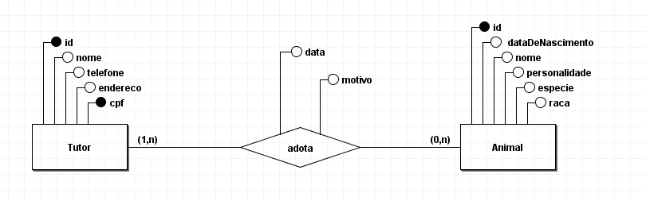

# Adoção de animais

## Sobre o projeto
Esse projeto foi desenvolvido com o intuito de praticar Spring Boot, 
utilizando JPA, Hibernate e PostgreSQL. Essa API tem o propósito de lidar com adoções de animais, sendo possível manter um histórico de todos os animais disponíveis para adoção e todas as adoções realizadas. O frontend desse projeto será desenvolvido em breve.

## Diagrama relacional

## Levantamento de requisitos

* Manter tutor
  * Cadastrar tutor
  * Atualizar nome, endereço e telefone
  * Deletar
  * Buscar todos os tutores
  * Buscar tutor

* Manter animal
  * Cadastrar animal
  * Atualizar nome e dataDeNascimento
  * Deletar
  * Buscar todos os animais
  * Buscar animal

* Manter adoção
  * Cadastrar adoção
  * Atualizar motivo
  * Deletar
  * Buscar todas as adoções
  * Buscar uma adoção
  * Buscar todos os animais adotados 
  por um tutor
  * Buscar todos os tutores que adotaram um animal
  * Deletar todas as adoções realizados por um tutor
  * Deletar todas as adoções de um animal

## Execução do projeto

1. Clone o projeto atráves do git clone `git clone https://github.com/marysclair/AdocaoDeAnimais-API.git` ou baixe em formato zip para descompactar. 
2. Crie o banco de dados no PostgreSQL e altere a URL de conexão do banco de dados com o nome do banco criado no arquivo application.properties. Adicione as suas informações privadas (nome do usuário e senha do Postgre).  
3. Inicie o projeto. Você pode consumir a API através de outro Frontend ou por interfaces como Insomnia.

## Documentação

Animal
URL	| Método | Descrição
------|------------|-----
/animals |	POST |	Recurso de criação de animais. Recebe como corpo de requisição um JSON contendo: `name`, `dateOfBirth`, `personality`, `species`, `breed`
/animals	| GET |	Recurso de exibição de dados de todos os animais cadastrados
/animals/:id |	GET	| Recurso de exibição de dados de um animal, recebe o `id` do animal como parâmetro
/animals/:id |	PATCH	| Recurso de atualização parcial das informações do animal, espera JSON contendo `name` e `dateOfBirth` como corpo da requisição e recebe o `id` do animal como parâmetro
/animals/:id	| DELETE |	Recurso de exclusão de animal que recebe um id como parâmetro

Tutor
URL	| Método | Descrição
------|------------|-----
/animalGuardians |	POST |	Recurso de criação de tutor. Recebe como corpo de requisição um JSON contendo: `name`, `phoneNumber`, `address`, `cpf`
/animalGuardians	| GET |	Recurso de exibição de dados de todos os tutores cadastrados
/animalGuardians/:id |	GET	| Recurso de exibição de dados de um tutor, recebe o `id` do tutor como parâmetro
/animalGuardians/:id |	PATCH	| Recurso de atualização parcial das informações do tutor, espera JSON contendo `name`, `address` e `phoneNumber` como corpo da requisição e recebe o id do animal como parâmetro
/animalGuardians/:id	| DELETE |	Recurso de exclusão de tutor que recebe um `id` como parâmetro

Adoção
URL	| Método | Descrição
------|------------|-----
/adoptions |	POST |	Recurso de criação de adoção. Recebe como corpo de requisição um JSON contendo: `animalGuardianId`, `animalId`, `date`, `reason`
/adoptions	| GET |	Recurso de exibição de dados de todos as adoções cadastrados
/adoptions/:id |	GET	| Recurso de exibição de dados de uma adoção, recebe o `id` da adoção como parâmetro
/adoptions/animalGuardians/:id |	GET	| Recurso de exibição de todos os animais adotados por um tutor, recebe o `id` do tutor como parâmetro
/adoptions/animals:id |	GET	| Recurso de exibição de dados de todos os tutores que adotaram um animal, recebe o `id` do animal como parâmetro
/adoptions/:id |	PATCH	| Recurso de atualização parcial das informações da adoção, espera JSON contendo `reason` como corpo da requisição e recebe o id da adoção como parâmetro
/adoptions/:id	| DELETE |	Recurso de exclusão de tutor que recebe um `id` como parâmetro
/adoptions/animal/:id	| DELETE |	Recurso de exclusão de todas as adoções de um animal, que recebe um `id` como parâmetro
/adoptions/animalGuardian/id	| DELETE |	Recurso de exclusão de todas as adoções realizados por um tutor, que recebe um `id` como parâmetro

